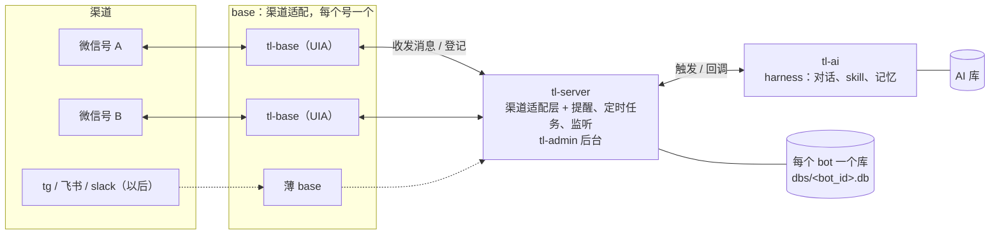

## 一、背景

真爱粉是一个自己定制的聊天机器人，到现在是第三代：

1. [true-love-robot](https://github.com/oreoft/true-love-robot)：fork 查克大佬的版本，所有业务写在一个客户端里。
2. [true-love-n](https://github.com/oreoft/true-love-n)：拆成 base（收发消息）和 server（业务），一台机器一套。
3. true-love-x：本仓库。

前两代底层都是 DLL 注入微信。新版微信基本不再支持这种方式，风险也高，现在主流是 UIA（Windows UI Automation），直接操作已经登录的微信客户端。所以 base 改用 UIA 来监听和操作微信，这样更合适。

需求也变了：要同时跑多个微信号，以后还想接 tg、飞书、slack 这类渠道。AI 服务作为 harness，负责对话、skill 和记忆，可以不断扩展能力的边界。多渠道统一交给 server 管理。base 只做适配：目前还是用 UIA 适配微信，以后接别的渠道，只要写一层很薄的 base 就够了。

## 二、架构

多个 base + 一个 server + 一个 AI：

- **base**：一个号一个。负责把渠道里的消息转成统一格式发给 server，并执行 server 下发的发送指令。启动时把自己的 `bot_id` 和回调地址登记到 server。
- **server**：只有一个，是所有渠道的适配层。对上只认 `bot_id`，对下按 bot 找到对应的 base。提醒、定时任务、聊天记录、微信监听都在这里，后台 tl-admin 统一管理所有 bot。
- **AI**：只有一个。收到 server 转来的消息后跑 agent，结果通过 server 发回去。

## 三、设计思路及折衷

1. **bot 是第一等概念**。一个 bot 就是某个渠道上的一个账号，`bot_id` 用这个账号在该平台的 id，微信就是 wxid。部署时注入 `BOT_ID`，base 启动时从微信的数据目录读出当前登录的 wxid 做核对，对不上就不启动。
   - 折衷：一个 bot 只属于一个平台。同一份记忆暂时不能同时用在微信和飞书上，真有需要时再加"渠道"这一层。
2. **功能分三类**：平台功能（技能、模型、日志）、全渠道功能（收发消息、提醒、定时推送、聊天记录）、渠道专属功能（比如微信监听）。全渠道功能由 server 统一实现；专属功能由对应的 base 额外提供接口，server 只对这个平台的 bot 开放。
3. **base 越薄越好**。base 只实现一套统一的协议：收消息、发文本、发文件（URL）、通知管理员、登记。平台之间的能力差异由 base 自己消化，比如飞书只能发 URL。接新渠道就是再写一个 base。
4. **通信方向固定**：base 只和 server 通信，server 和 base、AI 通信。媒体文件不共用目录，各服务通过 `/media` 开放自己的文件，对方拿 URL 自己下载。数据库里存相对路径，发给别的服务前再换成 URL。所以 base、server、AI 可以部署在不同的机器上。
5. **数据按 bot 分库**。server 给每个 bot 一个 SQLite 文件，隔离简单，迁移或删除一个 bot 就是处理一个文件。AI 保持一个库：会话和画像按 bot 区分，技能和模型所有 bot 共用。
   - 折衷：后台想做跨 bot 的汇总，就得逐个库查一遍。
6. **server 是单点**。它挂了，所有号会一起失联。数据都在它那里，不好做容灾，所以目前只靠自动重启。
7. **配置**：密钥放在私有的 config-center 仓库，部署时拉取，绝不打进镜像。每个 bot 各自的配置用一张以 `bot_id` 为 key 的表来维护。

> 本仓库正在按上面的设计改造，部分内容还是目标状态。
